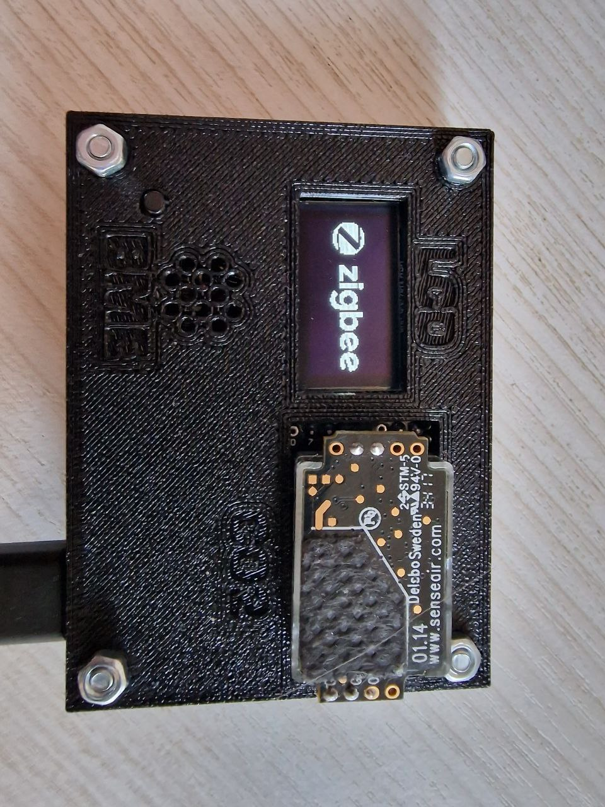
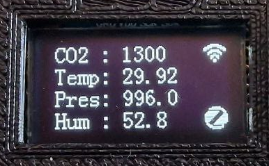
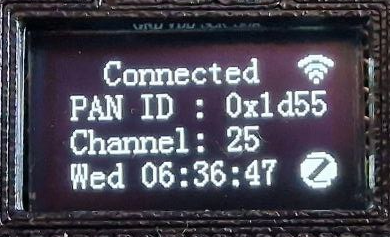

# esp32-c6 Air sensor
ESP32-C6 zigbee Air-sensor 1.0

Пример мультисенсора на ESP32-C6
Используется модули с Aliexpress с 5 вольтовым питанием:
* Esp32-c6   - плата разработчика (любая)
* Sensair S8 - сенсор Co2
* SSD1306    - OLED экран для вывода информации
* BME280     - Сенсор температуры, влажности, давления.\
  Кнопка boot используется для смены режимов вывода на экран, подключена к gpio9 и сброса устройства.
  
Плата собрана на макетке, просто проводами.
 

Sensair S8 подключается к UART линии, пины ESP
 * TXD_PIN (GPIO_NUM_5)
 * RXD_PIN (GPIO_NUM_4)
  
SSD1306 и bme280 подключаются к линии I2C, пины ESP
* sda = GPIO_NUM_6
* scl = GPIO_NUM_7

После сборки и прошивки плата запустится и будет ожидать получения данных от Sensair S8, чтобы не отображать нулевые показания. \
Сразу после включения плата начинает искать координатор и пытаться подключиться к сети zigbee. Покажет главный экран, и через 15 сек погасит экран.\
Кнопка бут имеет два функционала:
* Кратковременное нажатие, активация экрана и переключение отображения
* Длительное удержание > 1.5 сек сброс устройства.

Для платы распечатан простейший корпус, чтобы не обрвались провода ) 

Варианты экранов:\
Основной экран \

Экран статуса подключения \

Через 15 секунд после включения экран погаснет.

